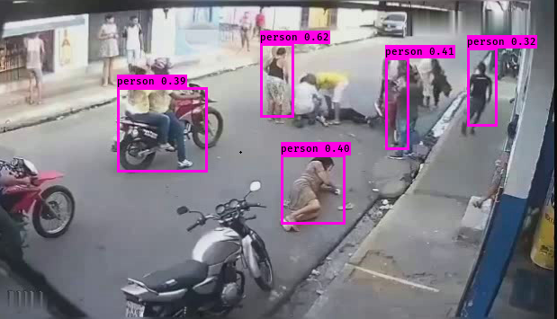

# DLA_YOLOv3-for-complex-events
A novel pedestrian detection framework under complex events


## Contents

- [Background](#background)
- [Install](#install)
	- [Dataset](#dataset)
	- [Weight](#weight)
- [Demo](#demo)
- [Training](#train)
- [Testing](#test)
- [Maintainers](#maintainers)
- [Contributing](#contributing)
- [License](#license)

## Background

  Pedestrian detection has always been an important task in the field of intelligent transportation system (ITS). State-of-the-art detectors work well on pedestrians under normal events, However, pedestrians in complex events often have more frequent occlusion. The detection model based on implicit anchors may be assigned to anchors with the same aspect ratio under the same feature map to predict the pedestrian due to the similar scale of pedestrians close to each other. Therefore, the visible body features of trained pedestrians are only concentrated in a relatively small area, which is easy to lead to missed detection. In addition, the traditional public datasets are high-definition images, and the model needs to adapt to more challenging fuzzy scenes under complex events. In order to solve the above problems, first of all, we believe that it is not enough to rely on the shallow network structure or a single feature map information. To detecting pedestrians in complex events not only rely on location semantics information of high-level network, containing color and texture information appropriately of low-level network. Therefore, we modified the basic framework of YOLOv3 and adopted a Deep Layer Aggregation (DLA) to reconstruct the backbone network; Secondly, in order to adapt the model to complex scenarios, a novel pedestrian dataset of complex events, HiEve , combined with VOC07 public dataset, is used for model training. Finally, several anchor-based models were compared on the CUHK Occlusion and HiEve test sets and the proposed method achieves state-of-the-art in terms of detection accuracy and speed under complex events. 

## Install


```sh
$ pip install -r requirements.txt
```
### Dataset

Before training, please download train sets and test sets from :
```
https://drive.google.com/drive/folders/1HUs8BI9rMqP8PGABVzVsQc4o2Tcf6ki2?usp=sharing
```
With tree datasets: `chunk_occlusion_voc`, `HiEve_test`,`VOCdevkit`.Please put them in the root directory of the project

### Weight
You can download the weight of the detection model from 
```
https://drive.google.com/drive/folders/1gD5vDtGsQxJ4kDYEr3bTVNW9ooLZdL3H?usp=sharing
```
Three weight: `dark_weight.h5`(original YOLOv3),`dla_weight.h5`(a novel model),`yolo_cocodataset`(open access). Putting them into the [model_data](model_data).
## Demo

To start a demo for pedestrian detection!

```
pyhon yolo_video.py --image
```



## Training

If you want to training your own model, you need to change the [train,py](train.py), the line 34,35(classes), line 119(which model to use,we apply two,one is original YOLOv3 and DLA). if you want to use original YOLOv3, you can change the line  as :
```
model_body = yolo_body(image_input, num_anchors//3, num_classes,'orginal_yolo')
```

## Testing 

After a long and hard training, you will get a good pedestrian detection model, stored in file logs/000/, and you need to copy it to the file [model_data](model_data).

We wrote a test file [test.py](yolo3/test.py), which matches the grount truth through IOU and confidence. It will generate a table file under the project folder.Your weight file (`line 23 `) should correspond to the model structure file (`line 46`). At last, We run the [cal_ap.py](yolo3/cal_ap.py), it will generate a complete AP record excel file and output the value of AP.


## Maintainers

[@RichardLitt](https://github.com/RichardLitt).

## Contributing

Feel free to dive in! [Open an issue](https://github.com/RichardLitt/standard-readme/issues/new) or submit PRs.

Standard Readme follows the [Contributor Covenant](http://contributor-covenant.org/version/1/3/0/) Code of Conduct.

### Contributors

This project exists thanks to all the people who contribute. 
<a href="https://github.com/RichardLitt/standard-readme/graphs/contributors"></a>


## License

[MIT](LICENSE) © Richard Littauer
